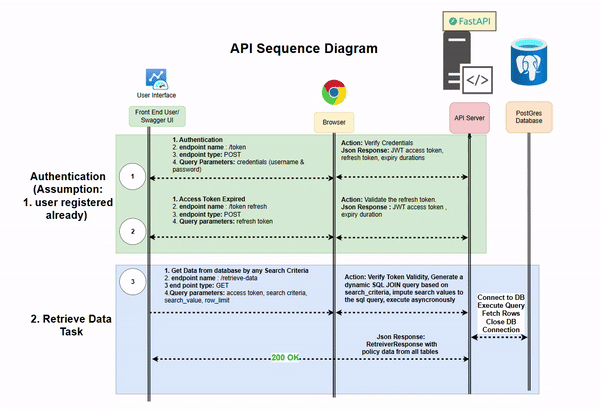
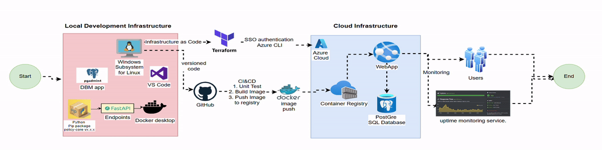
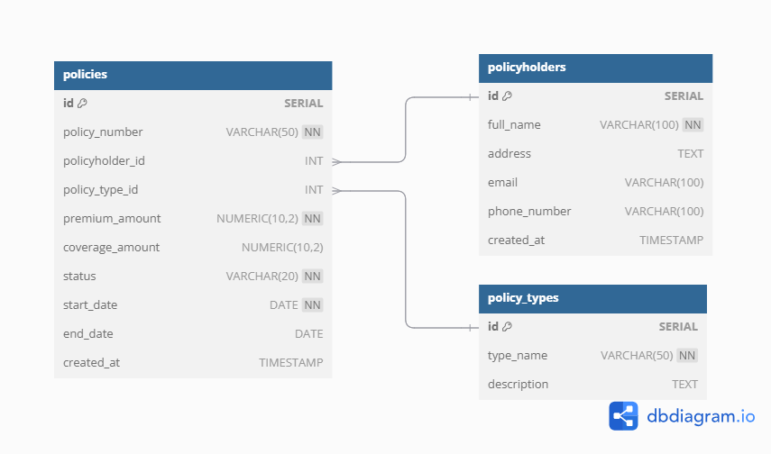
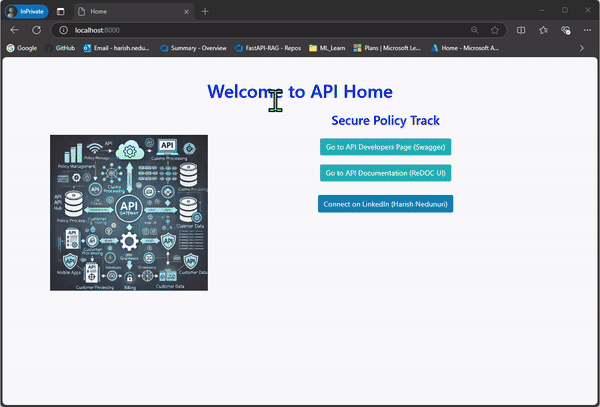

# SecurePolicyTrack

**Secure Policy Track** is an API for tracking and managing insurance policies securely. It provides endpoints for retrieving insurance policies. The API is built using FastAPI and uses a PostgreSQL database for data storage. It is designed to be secure (OAuth2 JWT-based token access) and scalable (leveraging asynchronous features).

The API is built using the ```policy-core==x.x.x``` **pip package**, which is a Python package that provides a set of tools for working with insurance policies.

## API Sequence Diagram



## System Infrastructure



## Database Schema



## Usage

- **Username and Password** are sent via email. Currently user registration and verification is not implemented



## Requirements

- Python 3.10 or higher
- PostgreSQL database cloud: pgAdmin4 for local development

## Local Installation

To run the Secure Policy Track API, follow these steps to set up and run the API locally:

1. Clone the repository to your local machine:

    ```bash
    git clone https://github.com/Harish-Nedunuri/secure-policy-track.git
    ```

2. Create a virtual environment and activate it:
    - For Linux/WSL:

        ```bash
        python -m venv .venv
        source .venv/bin/activate
        ```

    - For Windows:

        ```PS
        python -m venv .venv
        .venv\scripts\activate
        ```

3. Install the ```policy-core==x.x.x``` package and the required dependencies by running the following command:

    ```bash
    pip install -e .
    ```

4. Create a `.env` file in the root directory of the project and add the following environment variables:

    ```ini
    DEBUG=0
    SCM_DO_BUILD_DURING_DEPLOYMENT=1
    POSTGRES_ADMIN_USER=your_admin_user
    POSTGRES_ADMIN_PASSWORD=your_admin_password
    POSTGRES_HOST=your_postgres_host
    POSTGRES_PORT=your_postgres_port
    POSTGRES_INSDB=your_database_name_with_schema
    POSTGRES_SERVER=your_postgres_server
    SECRET_KEY=your_jwt_secret_key
    ```

5. Run the following command to start the FastAPI server without Docker:

    ```bash
    uvicorn main:app --reload
    ```

6. Run the following command to start the FastAPI server with Docker:

    ```bash
    docker system prune --force
    docker build -t <image-name>:tag .
    docker run -p 8000:8000 <image-name>:tag
    ```

7. Terraform commands to create infrastructure:  

    ```cd terraform```

    1. Run ```terraform init``` (if not done already).
    2. Run ```terraform plan``` to ensure everything is set up correctly.
    3. Run ```terraform apply``` to apply the changes.

8. Database Setup documentation

-- **Mock data** is generated using [Mockaroo](https://www.mockaroo.com/)

-- **Database schema** is generated using [dbdiagram.io](https://dbdiagram.io/home)

## Project Structure

This section outlines the core structure of the project:

``` plaintext

└── 📁secure-policy-track                    # Root directory of the project
    └── 📁.github                            #GitHub-specific configuration files
        └── 📁workflows                      -# GitHub Actions workflows
            └── docker-CICD-pipeline.yml     #CI/CD pipeline configuration for Docker
    └── 📁database_scripts                  # SQL scripts and database schema for the project
        └── create_insurance_schema.sql      # SQL script to create insurance schema
        └── insurance_schema.png             # Image of the insurance schema structure
        └── insurance_schema.sql             # SQL script of the insurance schema
        └── mock_policies_data_fixed.sql     # Mock data for insurance policies
        └── mock_policy_types_data.sql       # Mock data for policy types
        └── mock_policyholders_data.sql      # Mock data for policyholders
        └── README.md                        # Documentation for database scripts
    └── 📁documentation                      # Project documentation files
        └── SecurePolicyTracker.drawio       # Diagram of the project system architecture (draw.io format)
    └── 📁policy_core                        # Core module of the project
        └── 📁RetrieveTask                   # Module for retrieving data related to policies
            └── 📁src                        # Source code for retrieving tasks
                └── __init__.py              # Package initialization file
                └── models.py                # Models representing data structures
                └── retrieve_data_from_db.py # Logic for retrieving data from the database
            └── __init__.py                  # Initialization file for the RetrieveTask package
            └── args.py                      # Argument parsing for RetrieveTask
            └── entry.py                     # Entry point for RetrieveTask module
            └── router.py                    # FastAPI routes for RetrieveTask
        └── 📁SupportUtils                   # Utility functions used across the project
            └── 📁audit_utils                # Utilities for auditing and logging
                └── __init__.py              # Package initialization file
                └── logging.py               # Logging utilities
            └── 📁database_utils             # Utilities for database connections and queries
                └── __init__.py              # Package initialization file
                └── pgsql_connection.py      # PostgreSQL database connection handling
            └── 📁package_utils              # Utilities for handling package-related logic
                └── __init__.py              # Package initialization file
                └── arguments_utils.py       # Utilities for managing command-line arguments
            └── 📁secret_utils               # Utilities for managing secrets and configuration
                └── __init__.py              # Package initialization file
                └── config.py                # Configuration management utilities
            └── 📁security_utils             # Security utilities for authentication and authorization
                └── __init__.py              # Package initialization file
                └── auth_routers.py          # FastAPI routes for OAuth2 authentication
                └── oauth2_security.py       # OAuth2 security logic
            └── __init__.py                  # Initialization file for SupportUtils
        └── __init__.py                      # Initialization file for policy_core
        └── README.md                        # Documentation for the policy_core module
    └── 📁static                             # Static assets (images, icons, etc.)
        └── RAG.png                          # Image for RAG (Red, Amber, Green) status
        └── SecurePolicyTract_Sequencediagram.gif # GIF showing the API sequence diagram
        └── SecurePolicyTract_SystemDesign.gif   # GIF showing the system infrastructure
    └── 📁templates                          # HTML templates for web pages
        └── __init__.py                      # Package initialization file for templates
        └── base.html                        # Base HTML template
        └── home.html                        # Home page HTML template
    └── 📁terraform                          # Infrastructure as code using Terraform
        └── main.tf                          # Main Terraform configuration file
        └── README.md                        # Documentation for Terraform configurations
        └── variables.tf                     # Terraform variables file
    └── 📁tests                              # Test suite for the project
        └── README.md                        # Documentation for tests
        └── test_retrieve_task.py            # Test cases for RetrieveTask module
        └── test_security_utils.py           # Test cases for security utilities
    └── .dockerignore                        # Specifies files to ignore in Docker builds
    └── .env                                 # Environment variables for local development
    └── .gitignore                           # Specifies files to ignore in Git version control
    └── CHANGELOG.md                         # Project change log
    └── Dockerfile                           # Docker configuration for building the project image
    └── main.py                              # Entry point for running the FastAPI application
    └── package_setup.json                   # JSON file for package setup configurations
    └── README.md                            # Main project documentation
    └── requirements.txt                     # Python dependencies list
    └── setup.py                             # Script for setting up the Python package
```

## Future Development

- Add user registration, verification, and activation functionality.
- Add functionality for Dynamic Data Masking (DDM) of PII data in the database.
- Add secret key management for secrets.
- Add audit logging to track API usage.
- Add role-based access control for policy management and implement API scopes for policy creation and management.
- Add a `README.md` file for every directory and explain the purpose of each file.
- Add support for policy creation and management, including complete CRUD operations.
- Implement a user-friendly web interface for managing policies.
- Add Docker Compose for containerization of multiple services.
- Improve the CI/CD pipeline.
- Add multiple environments (Dev, QA, Prod) with a custom domain for each environment.
- Add TEXT2SQL functionality for querying the database, using ChatGPT for database querying.
